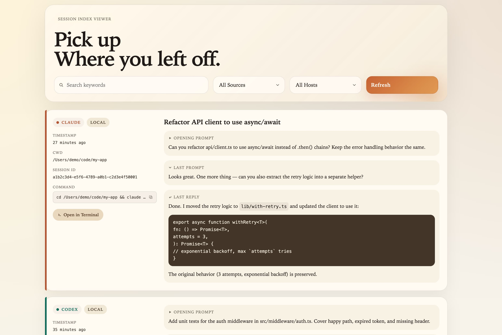

# session-index-viewer

**English** · [简体中文](README.zh-CN.md)

Local web viewer for Claude Code (`~/.claude/projects`) and Codex
(`~/.codex/sessions`) sessions. Browse recent sessions in one place,
search across both tools, and resume any session in a new Terminal
window with a single click.

<p align="center">
  
</p>

`claude --resume` and `codex resume` list sessions by id and timestamp
— not by what was actually said. This shows the opening prompt and
last reply of every session so you can spot the one you want and pick
up where you left off.

> **macOS only.** Uses launchd for autostart and AppleScript /
> `open -na` to launch Ghostty, iTerm, or Terminal.app. Auto-detects
> whichever is installed, in that order.

## Run

```bash
./install.sh            # install as launchd agent (run at login, keep alive)
open http://localhost:7333
```

Or run in the foreground: `python3 server.py`.

## Pieces

- `server.py` — stdlib-only HTTP server on `127.0.0.1:7333`.
  - `GET /` serves the viewer.
  - `GET /api/sessions?limit=100` scans session files live, with an
    mtime/size cache so only changed files are re-parsed.
  - `POST /api/resume` opens a Terminal window running
    `cd <cwd> && claude --resume <id>` (or `codex resume <id>`).
  - Host badges are inferred from each session's cwd: anything under
    this machine's home is `local`, anything under a different
    `/Users/<name>/` or `/home/<name>/` is labelled with `<name>`.
- `sessions-index.html` — card view with search, source/host filters,
  per-card Copy / Open Terminal resume buttons.
- `install.sh` — renders the launchd plist with absolute paths and
  bootstraps it. Logs go to `~/Library/Logs/session-index-viewer.log`.
- `index-sessions.sh` — legacy shell indexer that wrote
  `sessions-index.json`; superseded by `server.py`.

## Multi-machine setup

If you sync `~/.claude/projects` and `~/.codex/sessions` across
machines (e.g. with syncthing), no extra config is needed — each
session is auto-labelled by the username in its cwd prefix, and the
host filter in the toolbar picks them up. Sessions from a different
machine that happens to share your username show up as `local`.
